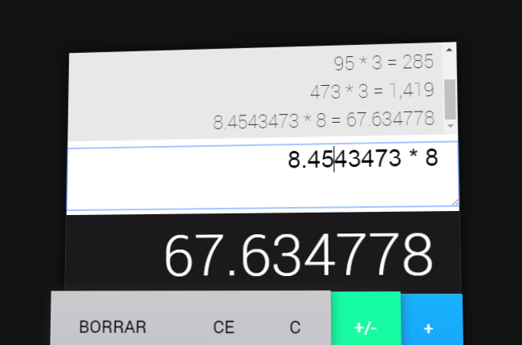

# Musical Calculator

Es una calculadora aritmética musical, desarrollado en React / Redux, Redux-observable, Rxjs y RxCSS.

[Ver versión desplegada](http://rafaelescala.com/calculator/)

La calculadora realiza las operaciones basicas, captura las operaciones ya sea dando clic a los botones como presionando las teclas, incluso permite escribir una ecuación personalizada a traves de un textarea en la parte superior. En adición se agrego una lista historica de las ultimas 5 ecuaciones realizadas, y este se actualiza y guarda en el sessionStorage.

Tambien se agregaron sonidos de los cuales son verificados si han sido cargados correctamente a traves del middleware



## Instalación

````
git clone https://gitlab.com/rafaesc92/musical-calculator.git
cd musical-calculator
npm install
npm run start
````

## Licencia

MIT
